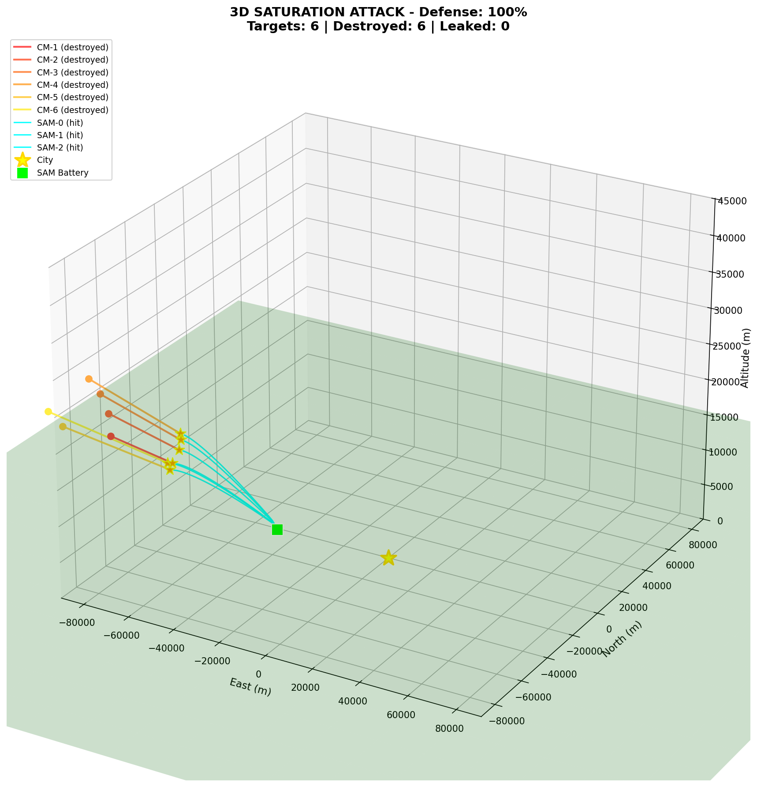

# Missile Defense 3D Simulation

A realistic 3D missile defense simulation featuring SAM (Surface-to-Air Missile) interceptors defending against incoming cruise missiles.



## Features

- **Full 3D Physics**: Earth-centered coordinate system with realistic flight dynamics
- **Advanced Guidance Systems**:
  - Boost phase: Fixed attitude toward predicted intercept
  - Midcourse: Lead pursuit with Kalman filter tracking
  - Terminal: Proportional navigation with 3D LOS rate
- **Realistic Flight Dynamics**:
  - G-limited turns using Rodrigues rotation formula
  - Thrust and gravity modeling
  - Speed and altitude constraints
- **Saturation Attack Scenarios**: Multiple incoming missiles vs. SAM battery
- **3D Animated Visualization**: Rotating camera view with real-time status panels

## Installation

1. Clone the repository:
   ```bash
   git clone https://github.com/vibecodejames/MissleDefense3D-1.git
   cd MissleDefense3D-1
   ```

2. Create a virtual environment and install dependencies:
   ```bash
   python3 -m venv .venv
   source .venv/bin/activate  # On Windows: .venv\Scripts\activate
   pip install numpy matplotlib
   ```

## Usage

### 3D Animated Visualization (Recommended)
```bash
python run.py --3d
```
Features a rotating camera view showing missiles and interceptors in 3D space.

### 2D Animation
```bash
python run.py
```
Classic top-down view of the engagement.

### Single Target Demo
```bash
python run.py --single
```
One-on-one intercept demonstration.

## How It Works

### Coordinate System
- Earth-centered 3D coordinates with the city at `[0, 0, Earth_radius]`
- Local tangent plane conversion for visualization (East/North/Up)

### Simulation Parameters
- **Targets**: 6 cruise missiles approaching at ~1000 m/s
- **Interceptors**: 8 SAM missiles with 85% probability of kill
- **Intercept Range**: 2km kill radius (fragmentation warhead)

### Color Coding
- **Yellow Star**: City (defense objective)
- **Green Square**: SAM battery
- **Red/Orange Lines**: Incoming cruise missiles
- **Cyan Lines**: SAM interceptors
- **Orange Stars**: Intercept explosions

## Project Structure

```
├── run.py                 # Entry point
├── Misslesim1draft.py     # Main simulation code
├── .gitignore
└── README.md
```

## Requirements

- Python 3.8+
- NumPy
- Matplotlib

## License

MIT License
